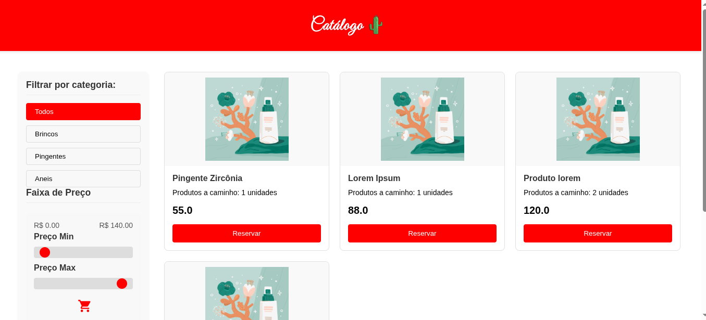

# E-Commerce Catalog App

 <!-- Coloque aqui uma imagem de destaque do projeto -->

Um aplicativo web completo de catálogo e e-commerce, desenvolvido com **React** no front-end e **Ruby on Rails** no back-end. Permite gerenciar produtos, categorias, movimentações de estoque e exibir produtos para os usuários em uma interface intuitiva e responsiva.

---

## Tecnologias

- **Front-end:** React, React Router, Axios, CSS
- **Back-end:** Ruby on Rails (API), PostgreSQL
- **Autenticação:** JWT
- **Banco de Dados:** PostgreSQL
- **Ferramentas:** Node.js, Yarn/npm, Rails CLI

---

## Funcionalidades

### Front-end
- Exibição de produtos com imagens, preço e descrição
- Filtros por categoria
- Busca de produtos
- Carrinho de compras (se implementado)
- Responsividade para desktop e mobile

### Back-end
- CRUD de produtos e categorias
- Cadastro de movimentações de estoque
- API RESTful para integração com o front-end
- Atualização automática do estoque e saldo do caixa
- Validação de dados e tratamento de erros

---

## Screenshots

### Página Inicial

### Lista de Produtos

### Cadastrar  Produto

### Administração / Movimentações

